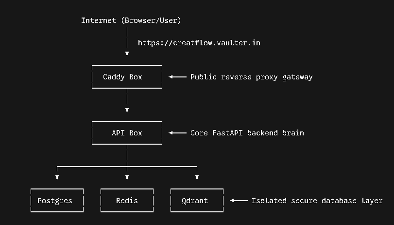

# CreatoFlow

Give it a YouTube video and an Instagram Reel. It pulls both transcripts and
their stats, works out the engagement rate, and lets you chat with the content —
the answers stream in, cite the exact moment in the video they came from, and the
chat remembers what you asked earlier.

I built this for the CreatorJoy screening. The brief wanted a dynamic full-stack
RAG chatbot with LangGraph + embeddings + a vector DB, and a real opinion on how
to run it cheaply at scale. This README is the honest version: what it does, why
I made the calls I made, and where the seams are — most of which come from the
fact that I built the whole thing on free tiers.

Live: frontend at https://creatoflow.vercel.app, backend at
https://creatoflow.vaulter.in.

---

## The one thing that actually matters

Everything here is standard except Instagram, which fights you, and YouTube on a
server, which also fights you. So most of the engineering went into making
ingestion reliable and keeping the rest boring. If you only read one section,
read "The hard parts" below.

---

## Running it

You need Docker (for Redis, Qdrant, Postgres) and a few free API keys.

```bash
cp .env.example .env          # fill in the keys (see below)
docker compose up -d          # redis + qdrant + postgres

# backend
cd backend
python -m venv .venv && source .venv/bin/activate
pip install -r requirements.txt
uvicorn app.main:app --reload --port 8000     # terminal 1
arq app.pipeline.worker.WorkerSettings        # terminal 2 (the worker)

# frontend
cd ../frontend
cp .env.local.example .env.local
npm install
npm run dev                                    # http://localhost:3000
```

Or use the Makefile: `make infra`, `make api`, `make worker`, `make web`.

You need four sets of keys, all free to start. A Google AI Studio key
(`GOOGLE_API_KEY`, plus `_2` and `_3` if you have them) drives both the Gemini
chat and the embeddings — get one at aistudio.google.com/apikey. A Groq key
(`GROQ_API_KEY`) runs Whisper transcription, from console.groq.com/keys. An
Apify token (`APIFY_TOKEN`) handles Instagram and the server-side YouTube
scraping, from console.apify.com. And an optional YouTube Data API key
(`YOUTUBE_API_KEY`) pulls YouTube metadata from any IP, from
console.cloud.google.com.

I'm running multiple Google keys on purpose — that's a free-tier thing I explain
later.

---

## How it works

You submit two URLs from the Next.js page to FastAPI. The backend hashes each
URL and checks whether it's seen it before (dedup). If a video is new or its
stats are stale, it pushes a job onto a Redis queue. A separate arq worker picks
the job up and does the slow, flaky work off the request path: scrape the
metadata and transcript (Apify, the YouTube Data API, or Groq Whisper depending
on the source), compute the engagement rate, chunk the transcript, embed each
chunk with Gemini, store the vectors in Qdrant, and save everything else to
Postgres. The frontend polls until both videos are "ready", then you chat: a
LangGraph agent retrieves the relevant transcript chunks from Qdrant and streams
its answer back over SSE.

Two videos are a "pair". Video A is the YouTube one, Video B is the Instagram
one. The chat scopes its searches to just those two.

Engagement rate is `(likes + comments) / views × 100`, with guards so a video
with hidden likes or zero views shows "n/a" instead of a fake number.

---

## The agent

The chat is a LangGraph `StateGraph` with two nodes: retrieve, then generate.
Retrieve embeds your question and runs a semantic search over both videos'
transcript chunks in Qdrant; generate makes one streaming LLM call that answers
from those excerpts plus the numeric stats. That's it — no ReAct loop, no
tool-calling round trip.

I started with a ReAct agent that had a retrieval tool and let the model decide
when to search. I took it out. Almost every question here is about the two
videos and should hit transcript search anyway, so the "should I search?"
decision was a wasted LLM call on every turn — it roughly doubled latency for no
benefit. Retrieving unconditionally is both faster and simpler. The numeric and
metadata questions (engagement rate, follower count, views) are answered from a
compact facts block I build into the system prompt, so those don't need a
transcript search at all.

The model is Gemini 2.5 Flash-Lite. I started on Flash and switched down: on
short-form transcripts the answer quality was indistinguishable, Flash-Lite is
cheaper and lower-latency, and I cap the output at 512 tokens and ask for ~150
words, which is the right length for this UI. Embeddings use
`gemini-embedding-001` truncated to 768 dimensions — the brief named
`text-embedding-004`, but Google deprecated that in January 2026, so I moved to
its successor. 768 dims keeps the index small with basically no quality loss on
text this short.

---

## The stack, and why

FastAPI with a Redis queue (arq) and a worker pool, because scraping and
transcription are slow and flaky and don't belong in the request. The API just
enqueues; the workers do the heavy lifting. To handle more load you run more
workers.

Qdrant for the vectors, not pgvector, even though I already run Postgres.
Qdrant's payload filtering lets me scope a search to "just Video A" or "just the
first five seconds" cheaply, and the vector workload scales separately from the
relational one. For two videos it's overkill; at 1000/day it's the right shape.
Chunks are ~400 tokens with ~60 token overlap, and every chunk is tagged with
its `video_id` so retrieval and citations always know which video a snippet came
from.

LangGraph for the agent, as described above. Postgres for metadata, status, chat
history, and thumbnails — plain SQL, no ORM. It works the same locally or on a
managed host like Supabase; you just change `DATABASE_URL`.

---

## The hard parts

Instagram. You can't reliably scrape it from a server anymore. yt-dlp won't give
you the creator's follower count and usually wants a login. So I use Apify (one
actor for the reel's stats and media, another for the follower count), and I put
it behind a provider interface with a cached-fixture fallback — if Apify fails
mid-demo, it serves a saved reel instead of crashing. That fallback is the
single most important design decision in here.

YouTube on a cloud IP. YouTube blocks datacenter IPs — both yt-dlp and the
transcript library get "confirm you're not a bot" from a server. I confirmed
this the hard way on this box. So for deployment I don't scrape YouTube
directly: metadata comes from the official YouTube Data API v3 (works from any
IP, free quota, gives views, likes, comments, subscribers and duration), and the
transcript comes from an Apify actor that runs on Apify's own IPs. There's a
toggle for this. The default fast hybrid (Data API plus a quick transcript
actor) finishes in about 15 seconds with approximate timestamps; flip "Exact
YouTube timestamps" and it uses a heavier actor that returns real SRT subtitle
timings but takes around 70 seconds. Locally, on a residential IP, it just uses
yt-dlp and the captions API and none of this matters.

Messy input. People paste URLs with tracking junk, or two URLs glued together.
The backend canonicalizes every URL down to the real video id before anything
touches it, so garbage in still works.

---

## Extra things I added (the production polish)

The core was working early, so I spent the rest of the time making it behave
like something you'd actually deploy.

Conversation history lives in Postgres, not in process memory, so it survives
restarts. Each turn only replays the last handful of messages, so a long chat
doesn't quietly blow up the token bill. Dedup is by URL hash, but views and
likes change, so a video older than 24 hours gets re-scraped on the next submit
instead of serving stale numbers forever.

Retrieval has a relevance floor that drops weak matches, an MMR rerank so you
don't get three near-identical snippets, and a time-window filter so "compare
the hooks in the first five seconds" actually searches the opening rather than
the whole video. The Gemini free tier is tiny, so the app round-robins across
several keys and fails over when one hits its limit. Ingest jobs retry transient
failures (network, rate limits, gateway errors) with exponential backoff and
record permanent ones so you can see what died.

Instagram's thumbnail URLs are signed and expire, and the CDN blocks
hotlinking, so I download the thumbnail once at ingest, store the bytes, and
serve them through the backend. The expensive endpoints have optional API-key
auth and per-IP rate limiting, off by default for local dev. On the frontend
there are loading skeletons, a retry button on failed cards, a new-chat button,
markdown answers, and citation chips that deep-link to the video at the right
second. There are around 40 tests (unit plus a couple of integration ones), and a
GitHub Actions pipeline that lints, type-checks, runs the tests against real
service containers, and builds the frontend.

---

## Free-tier trade-offs (read this)

I built the whole thing on free tiers, which shaped a surprising number of
decisions. The honest summary: at this scale, rate limits break before money
does.

The Gemini free tier is about 20 chat requests per day per project. That's
fine for a human clicking through a demo but dies instantly under real use. My
fix is key rotation: drop in several Google keys and the app round-robins and
fails over, so three keys is roughly three times the daily quota. The real fix
for production is a paid key; the rotation is the free-tier workaround. The keys
I'm currently using are ephemeral AI Studio tokens (they start with `AQ.` rather
than the usual `AIza…`) — they work but can expire, so a real deployment would
generate standard keys. The Data API key in particular has to be a standard
`AIza…` key with the API enabled.

Groq's Whisper free tier caps requests per day and audio-seconds per hour. Fine
for a handful of videos; at volume you'd self-host `faster-whisper` on a GPU and
the per-video cost basically goes to zero. Apify's free credits ($5/month, no
card) cover thousands of scrapes — plenty for a demo — but it's the main paid
line item at scale. And YouTube's datacenter-IP blocking is why ingestion routes
through Apify and the Data API on a server; the cheaper-at-scale alternative is
residential proxies, which I wired support for but didn't pay for.

The point of all of this is that everything degrades gracefully. If a key is
rate-limited the chat says "wait a few seconds" instead of erroring; if Apify
fails Instagram falls back to a fixture; if YouTube captions are blocked it falls
back to an actor, then to Whisper. A free-tier demo shouldn't be allowed to
hard-fail.

---

## Cost & scale: 1000 creators/day

Call it 2000 videos/day (one YouTube plus one Instagram each), about three
minutes long.

Instagram scraping via Apify is both the number one cost and the number one
reliability risk — roughly $6/day at this volume, and the thing most likely to
break. Transcription is next, around $4/day on Groq, and at this scale you'd
self-host Whisper on a GPU to remove both the cost and the free-tier rate cap.
Embeddings, Postgres and Qdrant storage are rounding errors. YouTube metadata
via the Data API is effectively free (10k units/day, about 2 units per video).
Chat on Gemini Flash is usage-driven rather than per-ingest and cheap per turn,
but long conversations are a silent multiplier, which is exactly why I cap the
replayed history.

So the lowest-cost, highest-quality version at scale: dedup hard by URL hash
(creators reshare the same videos), batch embeddings, self-host Whisper once you
clear the free tier, keep Gemini Flash for chat, and treat Instagram as the
dependency to cache and route around. The first thing I'd change with a budget
is moving transcription off Groq's free tier onto a GPU, and the Gemini keys
onto a paid plan.

What breaks first if you push this to 10,000 creators/day? Not the code — the
single box. Today the whole backend (api, worker, and all three databases) runs
as one Docker stack on one VPS, which is right for a demo and wrong for that
volume. The failure order is roughly: third-party rate limits and quotas go
first (Apify, Groq, Gemini — already the reason for key rotation and graceful
fallbacks), then the shared box becomes the bottleneck because the worker pool
contends with Postgres and Qdrant for the same CPU and disk. The fix is
mechanical and the architecture is already shaped for it: the queue means you
scale ingestion by running more worker containers, so you peel the workers off
onto their own machines, move Postgres and Qdrant to managed/clustered services
(Qdrant is a single node here — fine for a few hundred thousand vectors, not for
tens of millions), and put the API behind a load balancer. Nothing in the design
has to change; you're just unbundling the one box into tiers. The thing that
stays a hard dependency at any scale is Instagram — which is exactly why it sits
behind a provider interface with caching and a fixture fallback.

---

## Deployment

The frontend is on Vercel; the backend runs as a multi-container Docker stack on
a single VPS, fronted by Caddy for automatic HTTPS. Here's the shape of it:



A browser hits `https://creatoflow.vaulter.in`. Caddy is the only thing exposed
to the internet — it terminates TLS and reverse-proxies inward to the FastAPI
container. FastAPI (and its arq worker, the same image with a different command)
talks to Postgres, Redis and Qdrant over a private Docker network. Those three
stateful services do not publish any ports to the host, so the database layer is
unreachable from the outside; the only way in is through Caddy.

Why it's built this way, and the steps to stand it up:

1. Everything is one `docker-compose.prod.yml` — six services: redis, qdrant,
   postgres, the api, the worker, and caddy. The api and worker share one image
   (`build: ./backend`) and differ only in their start command, so a deploy
   rebuilds once and rolls both. Healthchecks gate startup order: Caddy waits
   for the api to be healthy, the api waits for all three databases to be
   healthy, so the stack comes up in a valid order every time.

2. HTTPS is mandatory and was the tricky part. A Vercel page is served over
   HTTPS and the browser blocks it from calling an `http://` backend
   (mixed-content), so the backend needs a real certificate. Caddy fetches one
   from Let's Encrypt automatically — but only if DNS already resolves to the
   box and ports 80/443 are open before the stack starts, because the cert
   challenge runs over those ports. So the order is: point an A record at the
   server, open the firewall, then `compose up`. The hostname isn't hard-coded —
   Caddy reads it from `SITE_ADDRESS` in the env file, so the same tracked
   `Caddyfile` works on any host. The Caddy config also sets `flush_interval -1`
   to disable response buffering, which is what lets the streaming `/chat` SSE
   endpoint flush tokens to the browser immediately instead of in one lump.

3. The box is shared with another project, so the prod stack is isolated by
   running under its own Compose project name (`-p creatoflow`) and its own env
   file (`.env.prod`), both baked into the `make prod-*` targets. That keeps its
   containers and named volumes from colliding with anything else on the host.
   On a server you also set `YOUTUBE_USE_APIFY=true`, because the datacenter IP
   gets YouTube-blocked.

4. Day-to-day it's a handful of make targets: `make prod-up` builds and starts
   everything, `make prod-deploy` pulls the latest code and rolls it,
   `make prod-logs` tails the app and proxy, `make prod-ps` shows status.
   Container logs are capped (10 MB × 3 files each) so a long-running box never
   fills its disk, and every service is `restart: unless-stopped` so it survives
   a reboot. Deploys are manual on purpose; the frontend still auto-deploys
   through Vercel's GitHub integration.

The full step-by-step runbook (DNS, firewall, env file, verification) is in
`docs/DEPLOY.md`.

---

## Testing

```bash
cd backend && source .venv/bin/activate
pytest                                  # unit tests
CREATORRAG_INTEGRATION=1 pytest         # also hit live Postgres/Qdrant
```

The tests cover the fiddly bits: engagement-rate edge cases, chunk-boundary
timestamps, URL dedup and canonicalization, the MMR rerank, the TTL logic, key
rotation and failover, and the provider routing and fallback.

---

## Honest limitations

The committed Instagram fixture is placeholder data — swap in a real reel before
recording a demo (see `backend/fixtures/README.md`). Fast-hybrid YouTube
timestamps are approximate (word-windowed); the exact toggle is there if you
need precise ones. Auth is an API key, which is gating, not real auth — the
per-IP rate limit is the meaningful protection, and real user login would be the
next step. And it's tuned for two videos at a time, which is the brief; scaling
the comparison beyond a pair would need schema and UI changes.

---

## Layout

```
backend/app
  config.py            all settings, nothing hard-coded
  urls.py              URL parsing / canonicalization
  db.py                Postgres: dedup, status, chat history, thumbnails
  embeddings.py        gemini-embedding-001, key rotation
  qdrant_store.py      collection, upsert, filtered search + MMR
  media.py             thumbnail fetch/proxy
  security.py          API key + per-IP rate limit
  keyring.py           Google API key rotation + quota detection
  ingest/              providers (youtube/instagram/fixtures), transcription, chunking
  pipeline/            arq worker, ingest job, retries
  rag/                 LangGraph retrieve→generate agent, SSE streaming
  routes/              videos, chat, health
frontend/src           Next.js app — cards, streaming chat, transcript modal
```
